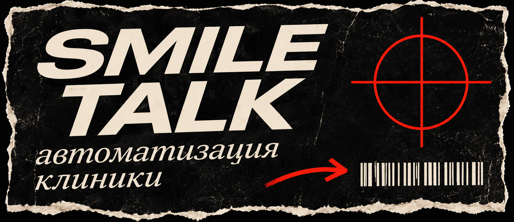

  <a href="https://t.me/r3in04ka"><strong>TELEGRAM ↗</strong></a>
  &nbsp; / &nbsp;
  <a href="mailto:r3in04ka@gmail.com"><strong>EMAIL ↗</strong></a>
  &nbsp; / &nbsp;
  <a href="PORTFOLIO.md"><strong>ПОРТФОЛИО →</strong></a>

[English](README.en.md) · [Сотрудничество](WORK-WITH-ME.md)

**Анастасия Вакуленко · AI Product Builder / AI Automation** 
Новосибирск · Удалённо или в офисе · Готова к переезду

**Ищу работу в AI-прототипировании и автоматизации.** Проектирую пользовательские сценарии, организую разработку с ИИ и проверяю результат.

[**CASHED! →**](cases/cashed.md) Концепция бренда, дизайн и сайт цифрового ателье.

[**SMILE TALK →**](cases/smile-talk.md) CRM, Telegram-боты и автоматические сводки. В кейсе — реальные экраны с тестовыми данными.

[**Purrsonal →**](cases/purrsonal.md) Открытый ИИ-помощник для Windows. [Скачать первую версию ↗](https://github.com/r3in04ka-prog/purrsonal/releases/tag/v0.1.0)

[**OpenPost →**](cases/openpost.md) Почтовый клиент для Windows: входящие, поиск, чтение и отправка. [Скачать ↗](https://github.com/r3in04ka-prog/openpost/releases/latest)

[**Euphoria →**](cases/euphoria.md) Сайт салона и пользовательский путь записи. В разработке.

  <a href="cases/cashed.md">CASHED!</a> ·
  <a href="cases/smile-talk.md">SMILE TALK</a> ·
  <a href="https://github.com/r3in04ka-prog/purrsonal/releases/tag/v0.1.0">Скачать Purrsonal</a> ·
  <a href="cases/euphoria.md">Euphoria</a>

  <a href="PORTFOLIO.md"><strong>ВИЗУАЛЬНЫЕ РАБОТЫ →</strong></a>
  &nbsp; / &nbsp;
  <a href="ABOUT.md"><strong>ОПЫТ И ПОДРОБНЫЕ КЕЙСЫ →</strong></a>
  &nbsp; / &nbsp;
  <a href="WORK-WITH-ME.md"><strong>СОТРУДНИЧЕСТВО →</strong></a>

Коротко о проектах и моей роли

- **CASHED!** — собственный цифровой бренд: концепция, дизайн, структура услуг и сайт с помощью ИИ. Сайт опубликован; бренд развивается.
- **SMILE TALK** — требования, продуктовая логика, интерфейсы, организация разработки с ИИ, тестирование и внедрение автоматизации клиники в сентябре 2026. Текущая эксплуатация после моего ухода не проверялась. В кейсе только тестовые данные.
- **Purrsonal** — открытый проект ИИ-помощника для Windows: котик поверх окон, свой сервер модели, чат, подтверждаемый запуск программ и напоминания. Первая тестовая версия; голос и управление экраном ещё не реализованы.
- **Euphoria** — сайт салона и сценарий онлайн-записи. В разработке; полный путь записи ещё предстоит завершить и проверить.

Использую ИИ для технической реализации. Моя зона ответственности — постановка задачи, продуктовые решения и проверка результата. [Подробнее о подходе и опыте →](ABOUT.md)

